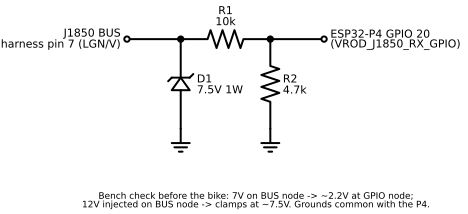
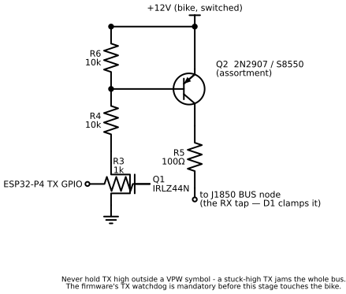
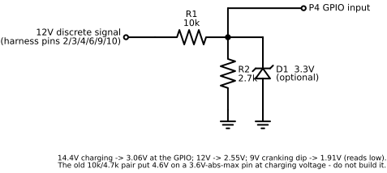

# DIY Digital Speedometer for 2009 Harley-Davidson VRSCF Muscle
## v5 FINAL — Complete Build Plan

**Full custom gauge replacement with:**
- 3.4" round 800×800 IPS touch display with toughened glass
- GPS speed/position tracking
- BLE phone integration (iOS ANCS/AMS + Android companion app)
- Navigation, music, caller ID display
- Speed camera & hazard alerts
- J1850 bus reading + IM simulation
- Proxy development harness for safe testing
- Full reversibility (can return to stock anytime)

**Total budget: ~€230** | **Target install: 2009 Harley-Davidson VRSCF Muscle**

---

## SHOPPING LIST — Confirmed AliExpress Cart

### Core Components

| Item | Link | Price | Notes |
|---|---|---|---|
| **Waveshare ESP32-P4 3.4" WIFI6 IPS Round Touch LCD** | [AliExpress](https://www.aliexpress.com/item/1005009157965757.html) | ~€86 | The brain. ESP32-P4 360MHz RISC-V dual-core + ESP32-C6 for WiFi6/BLE5. 800×800 round display, optically bonded toughened glass, 32MB PSRAM, 16MB flash (the listing says 32MB; the module on our board is 16MB — see `firmware/sdkconfig.defaults`), dual mics, microSD slot. |
| **GPS Module GY-NEO6MV2 (or M8N if available)** | [AliExpress](https://www.aliexpress.com/item/1005006740935763.html) | ~€7 | Position, speed, heading, time. **Pick NEO-M8N variant if available** — multi-constellation is much better in urban areas. |

### J1850 Bus Interface Components

| Item | Link | Price | Notes |
|---|---|---|---|
| **5pcs IRLZ44N Logic-Level MOSFET (TO-220)** | [AliExpress](https://www.aliexpress.com/item/1005007434482338.html) | ~€0.77 | J1850 bus TX driver. Logic-level gate turns on at 3.3V. |
| **100pcs Transistor Assortment (incl. 2N2222A)** | [AliExpress](https://www.aliexpress.com/item/1005004188649994.html) | ~€3.77 | J1850 bus RX + 12V signal voltage dividers. |
| **50pcs Zener Diode 1W Assortment (incl. 7.5V)** | [AliExpress](https://www.aliexpress.com/item/1005006639039658.html) | ~€0.65 | Bus voltage clamp protection. Use 7.5V variant. |
| **600pcs Metal Film Resistor Kit (1% precision)** | [AliExpress](https://www.aliexpress.com/item/1005009347924494.html) | ~€20 | Voltage dividers (10kΩ, 4.7kΩ, 1kΩ, 100Ω). Useful long-term for any electronics project. |

### Wiring & Connectors

| Item | Link | Price | Notes |
|---|---|---|---|
| **T-Tap Wire Connectors (Mixed)** | [AliExpress](https://www.aliexpress.com/item/1005006872234222.html) | ~€3.34 | For tapping bike's 12-pin harness without cutting. **Get red (22-18 AWG) + blue (18-14 AWG) mixed.** Need 9 red + 3 blue minimum. |
| **GT 12-Pin Sealed Waterproof Connector (15326849)** | [AliExpress](https://www.aliexpress.com/item/1005011688911042.html) | ~€23 | Generic Delphi GT 12-pin sealed connector. Used as pluggable interface between proxy box and DIY display. Get male+female pair. |
| **Mini560 Buck Converter 5V (10pcs)** | [AliExpress](https://www.aliexpress.com/item/1005007167054073.html) | ~€4.24 | 12V→5V for ESP32-P4 power. |
| **Silicone Wire 18-22 AWG (Red, 10m)** | [AliExpress](https://www.aliexpress.com/item/1005007007160447.html) | ~€2.34 | Heat-resistant, flexible. Critical for motorcycle vibration. |
| **Silicone Wire 18-22 AWG (Black, 10m)** | [AliExpress](https://www.aliexpress.com/item/1005007007160447.html) | ~€0.87 | Black for grounds. |

### Prototyping Supplies

| Item | Link | Price | Notes |
|---|---|---|---|
| **MB-102 Breadboard (830 + 400 points + jumpers)** | [AliExpress](https://www.aliexpress.com/item/1005011583761439.html) | ~€2.36 | Prototyping voltage dividers and J1850 circuit. |
| **Dupont Jumper Wire Kit (M-F, M-M, F-F)** | [AliExpress](https://www.aliexpress.com/item/1005003219096948.html) | ~€8.66 | For breadboard/P4 connections during development. |
| **Prototype PCB Boards 5×7cm / 7×9cm (10 pcs)** | [AliExpress](https://www.aliexpress.com/item/1005008742575241.html) | ~€5.41 | For final soldered J1850 circuit + voltage divider arrays. |
| **JST Connector Kit (SH/GH/ZH/PH/XH 1.0-2.5mm)** | [AliExpress](https://www.aliexpress.com/item/1005005763085908.html) | ~€27 | P4 board uses JST for speaker/battery/RTC. Having a kit saves headaches. |
| **2.54mm Pin Headers (Male/Female, 20 strips)** | [AliExpress](https://www.aliexpress.com/item/1005011781229719.html) | ~€2.61 | For P4's 40-pin GPIO header connections. |
| **PCB Screw Terminals 2-pin + 3-pin (50 pcs)** | [AliExpress](https://www.aliexpress.com/item/1005008625838032.html) | ~€7.37 | Proxy box screw-terminal access for development wiring. |

**AliExpress Total: ~€205**

### Local / Other (Tallinn electronics shop)

| Item | Where | Price | Notes |
|---|---|---|---|
| **Conformal coating spray (Plastik 70 or similar)** | Local electronics / Amazon | ~€10 | Spray finished PCB before install — protects against condensation. |
| **Heat shrink tubing kit assortment** | Local or AliExpress | ~€2 | If not in your existing supplies. |
| **Waterproof junction box IP65 (120×80×50mm)** | Local or AliExpress | ~€3 | Houses the proxy box. |
| **PG7 cable glands (10 pcs)** | Local or AliExpress | ~€1.50 | Seal cable entries on proxy box + final cluster housing. |
| **32GB microSD card (Class 10)** | You probably have one | ~€4 | OSM data + speed camera DB + ride logs. |
| **USB-C data cable** | You probably have one | ~€2 | Programming cable. **Must be DATA capable.** |

**Other Total: ~€22**

### **GRAND TOTAL: ~€225-230**

---

## OPTIONAL UPGRADES (buy later, not Phase 1-4 critical)

| Item | Purpose | Price |
|---|---|---|
| Solder seal connectors (heat-shrink + solder + seal) | For final permanent install | ~€2 |
| Bullet connectors (insulated 3.9mm, 50 pcs) | Disconnectable final connections | ~€2 |
| Waterproof handlebar button (22mm momentary) | Media/screen control while riding | ~€3 |
| BH1750 ambient light sensor | Auto-brightness day/night | ~€1 |
| ML1220 rechargeable RTC battery | Keeps clock when bike is off | ~€2 |
| 3M VHB double-sided tape | Mounting display in bezel | ~€3 |

---

## ARCHITECTURE

```
                    ┌─────────────────┐
                    │   Your Phone    │
                    │  (Android/iOS)  │
                    │                 │
                    │  Waze / GMaps   │── Nav instructions ──┐
                    │  Spotify / etc  │── Track metadata ────┤
                    │  Phone calls    │── Caller ID ─────────┤
                    └────────┬────────┘                      │
                             │ BLE 5 (ANCS/AMS/companion)    │
                             ▼                               │
                                                             │
Bike 12-pin                                                  │
 harness ──► PROXY BOX ──┬──► Stock cluster (dev mode)       │
              [T-taps]    │    OR                            │
                          │    DIY display via GT 12-pin     │
                          │                                  │
                          └──► Signal taps:                  │
                               │                             │
       ┌───────────────────────┘                             │
       │                                                     │
       ├─ J1850 Data ──► DIY transceiver ──► P4 GPIO         │
       │                  (IRLZ44N + 2N2222 + zener)         │
       ├─ +12V ──► Mini560 buck ──► 5V ──► P4 USB-C          │
       ├─ Ground ──► common GND                              │
       ├─ Turn L ──► voltage divider ──► P4 GPIO             │
       ├─ Turn R ──► voltage divider ──► P4 GPIO             │
       ├─ High beam ──► voltage divider ──► P4 GPIO          │
       ├─ Neutral ──► voltage divider ──► P4 GPIO            │
       ├─ Oil press ──► voltage divider ──► P4 GPIO          │
       ├─ Fuel sender ──► P4 ADC pin                         │
       ├─ VSS ──► P4 GPIO (pulse counter)                    │
       └─ Ignition ──► voltage divider ──► P4 GPIO           │
                                                             │
GPS (NEO-6M/M8N) ──► UART ──► P4 GPIO                       │
                                                             │
microSD (32GB) ◄── SDIO ── P4 ◄─────────────────────────────┘
  ├── OSM vector map data        ESP32-C6 co-processor (BLE radio only —
  ├── Speed camera database        no Bluetooth Classic):
  └── Ride data logs               WiFi 6 + BLE 5
                                   Phone notifications + media metadata
                                   + transport commands via the companion
                                   app's GATT link (Android) or ANCS/AMS
                                   (iOS, Phase 4)
```

(IM bus simulation TX happens on the P4 itself, through the IRLZ44N
transceiver on a GPIO — the C6 is only the phone radio.)

---

## V-ROD INSTRUMENT MODULE 12-PIN CONNECTOR PINOUT

| Pin | Wire Color | Signal | Type | T-tap Color | ESP32-P4 Connection |
|---|---|---|---|---|---|
| 1 | R/O (Red/Orange) | +12V Battery (constant) | Power | **Blue** | → Mini560 buck → 5V → P4 USB-C |
| 2 | White | High Beam | 12V discrete | Red | → Voltage divider → GPIO input |
| 3 | Violet | Left Turn signal | 12V discrete | Red | → Voltage divider → GPIO input |
| 4 | Brown | Right Turn signal | 12V discrete | Red | → Voltage divider → GPIO input |
| 5 | BK/GN (Black/Green) | Ground | Power | **Blue** | → Common GND |
| 6 | Grey | +12V Ignition (switched) | Power | **Blue** | → Voltage divider → GPIO (on/off detect) |
| 7 | LGN/V (Light Green/Violet) | **J1850 Data Bus** | Digital bus | Red | → DIY transceiver (RX + TX) |
| 8 | (3-pin sub-connector) | Vehicle Speed Sensor | Pulse | Red | → GPIO input (pulse counter) |
| 9 | GN/Y (Green/Yellow) | Oil Pressure warning | 12V discrete | Red | → Voltage divider → GPIO input |
| 10 | TN (Tan) | Neutral indicator | 12V discrete | Red | → Voltage divider → GPIO input |
| 11 | Y/W (Yellow/White) | Fuel Level sender | Analog resistance (see note) | Red | → ADC pin (GPIO 22 reserved) |
| 12 | O/W (Orange/White) | Accessories | 12V accessory | Red | → Optional |

---

## J1850 BIDIRECTIONAL TRANSCEIVER CIRCUIT

> J1850 VPW is an **active-high** single-wire bus: recessive = 0V,
> dominant = ~7V *sourced by the transmitting node*. The TX stage must
> therefore be a switched high-side source — connected to the bus only
> while transmitting a dominant symbol. (An earlier revision of this
> schematic had the 12V pull permanently on the bus with a low-side
> MOSFET shorting it to ground — that polarity is inverted and would
> jam the bus dominant whenever idle. Do not build that version.)

**Rendered schematics (canonical, print these for the bench):**
[RX front end](schematics/j1850_rx.svg) — build first, sniff-only ·
[TX stage](schematics/j1850_tx.svg) — Stage 4 only.
Sources + regenerate instructions in [`schematics/`](schematics/).





Text fallback:

```
                       +12V (from bike)
                         ├──────────────┐
                       emitter         ┌┴┐
              ┌────── Q2: PNP          │ │ R6 10kΩ (base pull-up:
      10kΩ ───┤ base   (2N2907/S8550)  └┬┘  Q2 hard off when idle)
        │  R4 └────── collector ── 100Ω ─┴─► J1850 BUS
      drain              R5                    │
   Q1: IRLZ44N                                 ├── D1 7.5V Zener ── GND
  gate ◄─ R3 1kΩ ─ ESP32-P4 TX GPIO            │   (cathode to bus; sets ~7V
      source                                   │    dominant level + clamps)
        │                                      │
       GND                                     ├── R1 10kΩ ──┬── ESP32-P4 RX GPIO
                                               │          R2 4.7kΩ
                                               │             │
                                               └─────────────┴── GND
```

- **Writing**: TX GPIO high → Q1 conducts → pulls Q2's base low through
  R4 → Q2 sources +12V through R5 onto the bus; the 7.5V zener clamps
  the driven level to ~7V (the VPW dominant level). TX GPIO low → Q1
  off, R6 holds Q2's base at the emitter rail → Q2 hard off → bus
  released to recessive 0V. Never hold TX high outside a VPW symbol —
  a stuck-high TX jams the whole bus.
- **Reading**: 10kΩ/4.7kΩ steps 7V → ~2.2V (safe for the P4's 3.3V GPIO).
- **Protection**: the same 7.5V zener clamps transients on the bus wire.
- **Software**: Port `J1850-VPW-Arduino-Transceiver-Library` to ESP-IDF
  (its schematic image in `img/schematics.jpg` is the reference for the
  analog front end — cross-check on the breadboard before the bike).
- **Bench-validate first**: sniff-only (RX path, no Q1/Q2 populated)
  against the live bus before ever enabling TX.

### 12V Discrete Signal Voltage Divider (×6 — for turn L/R, high beam, neutral, oil pressure, ignition)



Text fallback:

```
12V signal ──── 10kΩ ────┬──── ESP32-P4 GPIO input
                         │
                       2.7kΩ   (optional: 3.3V zener in parallel,
                         │      cathode up — belt-and-braces clamp)
                        GND
```

Sized for the real electrical system, not the nameplate 12V: with the
engine running the "12V" rails sit at ~14.4V charging voltage. The
earlier 10kΩ/4.7kΩ divider gave 3.8V at 12V and **4.6V at 14.4V — both
above the ESP32-P4's ~3.6V absolute maximum** (P4 GPIOs are not 5V
tolerant; do not rely on protection diodes). 10kΩ/2.7kΩ gives 2.55V at
12V and 3.06V at 14.4V — a clean logic high with margin. Belt-and-braces
option: add a 3.3V zener (from the zener kit) across the lower resistor.

---

## PROXY BOX DESIGN

```
┌─────────────────────────────────────────────────────────────┐
│                        PROXY BOX                            │
│                  (IP65 junction box)                        │
│                                                             │
│  Bike harness ──► T-taps on each wire ──► Internal PCB     │
│                                                             │
│  ┌──────────────────────────────────────────────────┐       │
│  │              PROXY PCB (perfboard)                │       │
│  │                                                   │       │
│  │  ┌────────────────────────────────────────────┐  │       │
│  │  │ DIY J1850 Transceiver                      │  │       │
│  │  │ (IRLZ44N + 2N2222 + 7.5V zener +          │  │       │
│  │  │  resistors) ──► Pin 7 (J1850 data)         │  │       │
│  │  └────────────────────────────────────────────┘  │       │
│  │                                                   │       │
│  │  6× voltage dividers (10kΩ + 2.7kΩ each)         │       │
│  │  for pins: 2,3,4,6,9,10                          │       │
│  │                                                   │       │
│  │  Pins routed through screw terminals              │       │
│  └──────────────────────────────────────────────────┘       │
│                                                             │
│  ┌──────────────────────────────────────────────────┐       │
│  │           SCREW TERMINAL BLOCKS                   │       │
│  │  Connect to P4 via dupont wires (development)    │       │
│  │  OR connect to GT 12-pin connector (testing)     │       │
│  └──────────────────────────────────────────────────┘       │
│                                                             │
│  ┌──────────────────────────────────────────────────┐       │
│  │         GT 12-PIN OUTPUT CONNECTOR                │       │
│  │  ──► Stock cluster (pass-through)                 │       │
│  │  OR ──► DIY display (testing)                     │       │
│  └──────────────────────────────────────────────────┘       │
│                                                             │
└─────────────────────────────────────────────────────────────┘
```

### Lifecycle

```
DEVELOPMENT:  Bike ──► Proxy ──► Stock cluster (riding works normally)
                         └──► P4 on desk (sniffing + coding)

TESTING:      Bike ──► Proxy ──► DIY display via GT 12-pin (field testing)

FINAL:        Bike ──► DIY display directly (proxy → toolbox drawer as backup)
```

---

## IM (Instrument Module) SIMULATION

### Why it's needed
The V-Rod ECM expects the stock IM to respond on the J1850 bus. Without it: U1255 DTC (missing response), possible TSSM security lockout.

### How it works
The P4 firmware periodically sends the same J1850 messages the stock IM sends, via the IRLZ44N MOSFET TX circuit. The ECM sees a "live" IM and stays happy.

### Implementation steps

**Step 1 — Capture (Phase 1)**
- Proxy box passes everything to stock cluster
- Log ALL J1850 traffic for 5+ minutes (ignition on, engine running, riding)
- Filter: identify messages the IM SENDS (not the ECM)
- Document: message bytes, timing intervals, CRC values

**Step 2 — Replay (Phase 3)**
- Program P4 to send captured IM messages at correct intervals
- Use IRLZ44N MOSFET TX circuit to transmit on bus
- J1850 VPW bit timing in GPIO interrupt (64µs/128µs pulses)

**Step 3 — Test (Phase 4)**
- Disconnect stock cluster from proxy box output
- P4 running IM simulation firmware
- Check for U1255 or any other DTCs
- Test key fob unlock → start → ride → stop cycle

**Step 4 — Security handshake (if needed)**
If TSSM security fails without stock IM:
- Option A: Capture and replay security handshake (complex)
- Option B: Screamin' Eagle Pro tuner → disable TSSM
- Option C: Keep stock IM wired in parallel, hidden under airbox (fallback)

### CRC
J1850 VPW uses CRC-8 with polynomial 0x1D. Implement in firmware or use existing library.

---

## PHONE INTEGRATION (BLE)

### iPhone — Zero setup (built-in ANCS + AMS)
- **ANCS** (Apple Notification Center Service): turn-by-turn nav, caller ID, all notifications
- **AMS** (Apple Media Service): track + artist + play/pause/skip control
- No companion app required — pair via iOS Settings, done

### Android — Companion app required (✅ built in Phase 2.5)
- Kotlin/Compose app in `companion/` with `NotificationListenerService`
  + `MediaSessionManager` listeners, a foreground BLE service, LE Secure
  Connections bonding, and a device-picker UI
- Notifications + media metadata → custom TLV over BLE GATT → P4;
  transport commands (call accept/reject, media prev/play/next) come
  back over the notify characteristic
- AVRCP is **not** an option: the C6 radio is BLE-only, no Bluetooth
  Classic — that's exactly why the companion app exists

### Display priority (highest to lowest)
1. Incoming call overlay (auto-dismiss after call)
2. Speed camera / hazard alert (10-15 sec hold)
3. Navigation instruction (when nav active)
4. Music now-playing (ticker bar)
5. Gauges (always visible)

---

## PROJECT PHASES

### Phase 1: Sniffing & Capture (Weekends 1-2) — ⏳ pending
- Build J1850 transceiver circuit on breadboard
- Wire proxy box with T-taps to bike harness
- Pass-through to stock cluster (bike still works normally)
- Log all bus traffic via ESP-IDF + USB serial
- Identify IM response messages for simulation
- Verify speed, RPM, gear, temp decode against real values

> Phase 1 was effectively deferred — we built the gauge UI against a
> synthetic driving cycle first (Phase 2 below) so the display side could
> be verified without the bike. Sniffing returns when the bench transceiver
> is wired up and the bike's available.

### Phase 2: Gauge Display (Weekends 3-4) — ✅ complete
- ESP-IDF v6.0.1 + LVGL 9.4 on the 800×800 round display
- Full widget set: tach (270° glow arc + redline + zoom labels +
  shift-light), speedometer, gear, fuel, temp, turn signals, 7 warning
  lamps in chevrons, clock + odo + dual trip counters
- UI driven by `vehicle_data_t` (mutex-guarded), produced by a
  synthetic 32-s driving cycle in `firmware/main/simulator/sim_engine.c`
- 30 FPS rendering with skip-if-unchanged caches; sim/UI core-pinned
- See `firmware/docs/01-PHASE2-DISPLAY-PLAN.md` "Outcome" for the full delta

### Phase 2.5: Off-bike feature work — ✅ complete
Filled the bench time while J1850 + GPS hardware shipped; everything below
landed on the board we already had (Waveshare ESP32-P4 with onboard
ESP32-C6 BLE/WiFi). Capped off with the BMW-style gauge redesign and a
CI-enforced 100% line/branch coverage gate over all host-testable firmware
code. Loose ends carried forward are listed at the bottom of
`02-PHASE2.5-OFFBIKE-PLAN.md`.

- Touch + screen-switching framework (GT911 → LVGL indev, screen
  manager swapping ride / settings)
- NVS persistence (settings survive reboot)
- Settings screen with kph/mph toggle, trip reset, brightness
- Units conversion threaded through every speed/distance widget
- BLE phone integration (Android companion app + SC bonding +
  directed advertising; iOS ANCS/AMS deferred to Phase 4)
- Speed-camera alert framework — data format + alert engine + fake
  GPS test harness; end-to-end validation when GPS arrives

See `02-PHASE2.5-OFFBIKE-PLAN.md` for the full plan + ordering.

### Phase 3: IM Simulation + GPS (Weekends 5-6) — ⏳ active (see `03-PHASE3-J1850-GPS-PLAN.md`)
- Program IM message replay via IRLZ44N TX
- Test: disconnect stock cluster, verify no U1255
- Wire NEO-6M/M8N to P4 UART
- ~~Parse NMEA sentences → position/speed/heading~~ ✅ landed at kickoff
  (`nmea.c` host-tested at 100%, `gps_uart.c` producer behind
  `CONFIG_VROD_GPS_UART`)
- GPS speed as backup + position for alerts

### Phase 4: BLE Phone Integration (Weekends 7-9) — Android half done in 2.5
- iOS: ANCS + AMS via the C6 (cluster becomes a GATT client of the
  iPhone — needs peer GATT discovery + two new parsers; see the iOS
  scope decision in the Phase 2.5 plan)
- ~~Android: build companion app + BLE relay~~ ✅ landed in Phase 2.5,
  including call overlay, media banner + working prev/play/next
- ~~Remaining Android polish: companion auto-reconnect after a cluster
  power cycle~~ ✅ landed at Phase 3 kickoff (background autoConnect on
  link loss)
- Navigation banner (needs turn-by-turn intent from a phone app)

### Phase 5: Speed Camera Database — on-bike validation (Weekend 10)
- Download SCDB.info / OSM camera data for Estonia/Baltics
- Import into the binary DB format defined in Phase 2.5 Stage 7
- Store on microSD; the cluster mounts the card and loads the DB on boot
- End-to-end validation on a moving bike: real GPS fix → real camera
  detected by the alert engine (already built in Phase 2.5) → warning
  popup + audio beep fire on the actual ride

> The alert engine, DB binary format, warning popup widget, fake-GPS
> producer, and host unit tests were front-loaded into Phase 2.5
> Stage 7 because all of that is exercise-able off-bike. Phase 5 is
> now scoped to "plug in real data + validate on the road".

### Phase 6: Full Cluster Replacement (Weekends 11-12)
- Read all 12-pin discrete signals (turns, beam, oil, neutral, fuel)
  - **Fuel sender caveat (verified July 2026):** the 2009 VRSC uses an
    **ultrasonic** fuel level sensor (P/N 75210-09, mandatory for MY2009
    — HD service bulletin M-1249), not a plain float. It is powered
    (+12V/GND) and presents an ohmic output to the gauge line, so the
    ADC-read plan stands electrically — but the level calibration,
    temperature compensation, and only-update-while-moving gating all
    lived in the stock IM's reflashable firmware and must be
    re-implemented by us (we have speed and temp data). Plan for a
    bench characterization session (sender + PSU, measured fills →
    ohms curve). Fallback/complement that needs no sender at all:
    integrate the ECM's J1850 fuel-consumption ticks (A8 83 10 0A,
    0.000040 L each) from a full-tank reset — the classic fuel-computer
    approach, and likely *more* stable than the notoriously erratic
    ultrasonic sender. The J1850 fuel-gauge broadcast (A8 83 61 12) is
    almost certainly IM-originated (the sender wires to the IM), so it
    disappears when the stock IM does — Stage 2 captures will confirm.
- Display all indicator icons on gauge
- 3D print mounting bracket for 86mm display in 95mm bezel
- Conformal coat PCB
- Final install: connect P4 directly to bike harness (bypass proxy)
- Keep proxy box as backup in toolbox

### Phase 7: Polish & Daily Ride (Ongoing)
- Auto-brightness (BH1750 sensor or time-based)
- Color themes, startup animation
- Handlebar button for media/screen control
- WiFi config portal for settings
- SD card ride logging
- **OTA firmware update with on-screen progress** — once the cluster is
  installed on the bike, USB flashing requires opening the housing. OTA
  lets a new image be delivered over BLE (from the Android companion) or
  Wi-Fi (during dev). Because the app stays running through the download,
  the screen can render an "Updating xx %" splash + "do not power off",
  unlike USB flashing where the app isn't running and the panel shows the
  last framebuffer state. Implementation outline:
    - Custom partition table with `ota_0` / `ota_1` + `otadata` (currently
      a single `factory` partition; can't OTA without splitting).
    - `esp_https_ota` or `esp_ota_*` raw API to write the inactive slot
      from a streaming source (BLE GATT chunks or HTTPS).
    - Companion-side: chunk + ACK protocol over a dedicated OTA GATT
      characteristic, with a CRC of the full image checked before
      `esp_ota_set_boot_partition()`.
    - UI: a dedicated screen (or a banner overlay on the ride screen)
      that renders progress, ETA, and a graceful failure path if the
      update is interrupted.
    - Out of scope for the link-bring-up bisect; flagged here so it
      isn't forgotten once BLE is fully wired in. See
      `firmware/docs/ble-bringup-bisect.md` for the build-blocker history.
- Vector map rendering (future)
- Voice commands via P4's onboard mics (future)

---

## J1850 VPW MESSAGE DECODE TABLE

```
HEADER             DATA          MEANING
28 1B 10 02 HH LL  HH LL        RPM = (HH<<8 | LL) / 4
48 29 10 02 HH LL  HH LL        Speed = (HH<<8 | LL) / 128  [km/h]
48 3B 40 XX         XX           Neutral if (XX & 0x20), Clutch if (XX & 0x80)
48 DA 40 39 XX      XX           Turn signals: 1=left, 2=right, 3=both
68 88 10 03         —            Check Engine OFF
68 88 10 83         —            Check Engine ON
A8 3B 10 03 XX      XX           Gear: 1,3,7,15,31,63 → gears 1-6
A8 49 10 10 XX      XX           Engine temp — HarleyDroid decodes the raw
                                 byte as °C directly (no offset); verify
                                 against the stock gauge during the sniff
A8 69 10 06 HH LL  HH LL        Odometer: 1 tick = 0.4 meters
A8 83 10 0A HH LL  HH LL        Fuel consumption: 1 tick = 0.000040 L
A8 83 61 12 DX      DX           Fuel gauge 0-6 (0=empty, 6=full)
```

---

## DISPLAY LAYOUT (800×800 round)

```
          ╭────────────────────────────╮
        ╱                                ╲
      ╱   ⚠ SPEED CAMERA 800m ahead       ╲
     │                                      │
     │          ╭─────────╮                 │
     │         │  147     │    ┌───┐        │
     │         │  km/h    │    │ 4 │        │
     │          ╰─────────╯    └───┘        │
     │                                      │
     │   🌡92°C   ⛽████░░   ⏱12,847km     │
     │                                      │
     │  ┌──────────────────────────────┐    │
     │  │ ↰ 200m  Pärnu mnt    14:32  │    │
     │  └──────────────────────────────┘    │
      ╲  ♫ Smells Like Teen Spirit        ╱
        ╲  ◄ N ► 📱 ☀ ⚠ 🔧              ╱
          ╰────────────────────────────╯
```

---

## CRITICAL WARNINGS

### Immobilizer
IM simulation should prevent U1255. If TSSM security still fails, consider Screamin' Eagle tuner or keep stock IM wired in parallel.

### Weatherproofing
- Conformal coat PCB before install
- P4's optically bonded toughened glass is already waterproof on the display side
- Seal cable entries with PG7 cable glands
- Use silicone wire (vibration + heat resistant)
- Stock VRSCF cluster housing provides good water resistance for the install

### Legal (Estonia / EU)
A functioning speedometer is required for road use. GPS speed as backup adds redundancy. Run proxy + stock cluster during testing period.

### Power
- Use keyed +12V (Pin 6) for on/off with ignition
- Constant +12V (Pin 1) through buck converter for P4 power
- Add 470µF capacitor on 5V rail to absorb cranking voltage spikes
- P4 boots in ~2 seconds — no graceful shutdown needed

---

## DEVELOPMENT ENVIRONMENT

(As actually set up — see `PROJECT-BRIEF.md` for the live version.)

- **OS**: macOS (MacBook Pro)
- **Editor**: Zed + clangd via `compile_commands.json`
- **Framework**: ESP-IDF v6.0.1 (native C/C++)
- **Target chip**: esp32p4
- **Display**: LVGL 9.x via ESP-IDF component manager
- **BLE**: NimBLE host on the P4, controller on the ESP32-C6
  co-processor via esp_hosted VHCI over SDIO
- **Programming**: USB-C cable to P4 board (no separate programmer needed)

---

## REFERENCES

| Resource | URL |
|---|---|
| **Hardware** | |
| Waveshare P4 3.4C wiki | https://www.waveshare.com/wiki/ESP32-P4-WIFI6-Touch-LCD-3.4C |
| **J1850 / Vehicle** | |
| HarleyDroid (decode table) | https://github.com/stelian42/HarleyDroid |
| DIGTACHO (PIC decoder ref) | https://github.com/momex/DIGTACHO |
| HD J1850 Visual Display | https://hackaday.io/project/162865 |
| J1850 VPW Arduino Library | https://github.com/matafonoff/J1850-VPW-Arduino-Transceiver-Library |
| **Display / UI** | |
| LVGL documentation | https://docs.lvgl.io |
| ESP-IDF documentation | https://docs.espressif.com |
| **BLE / Phone** | |
| ESP32 ANCS library | https://github.com/Smartphone-Companions/ESP32-ANCS-Notifications |
| ESP32 AMS library | https://github.com/marmotton/esp32-apple-media-service |
| NimBLE (lightweight BLE) | https://github.com/h2zero/NimBLE-Arduino |
| ESP32-A2DP (AVRCP) | https://github.com/pschatzmann/ESP32-A2DP |
| **Alerts / Maps** | |
| SCDB speed camera database | https://scdb.info |
| OpenStreetMap | https://openstreetmap.org |

---

## VALUE COMPARISON

| Solution | Cost | Capabilities |
|---|---|---|
| **This DIY build** | **€230** | 800×800 display, GPS, BLE phone integration, speed camera alerts, IM simulation, custom UI, ride logging, future expansion |
| Motogadget Motoscope Pro + V-Rod adapter | ~€800-1000 | Premium dash, no fuel/gear/ABS |
| Dakota Digital MCV-7000 | ~€500 | Digital gauge, no phone integration |
| Exotic Choppers airbox kit | ~€500-600 | Same Dakota Digital in airbox |
| Stock cluster repair | ~€600-800 | Just back to OEM |

---

*Project for 2009 Harley-Davidson VRSCF Muscle*
*Stock speedometer dial: 75mm | Display: 86mm (3.4" round, 800×800)*
*Fits inside 95mm stock cluster housing with minor bezel modification*
*Proxy harness allows full reversion to stock anytime (dealer visits, resale)*

**Total budget: ~€225-230**
