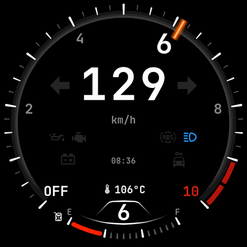

# Zeppl — Roadmap

The single stage-by-stage map of the build: four phases, each with a status and
links to its detail docs. The narrative status snapshot is in
[`PROJECT-BRIEF.md`](PROJECT-BRIEF.md); the evergreen hardware/bus reference is
in [`reference/`](reference/).

**Legend:** ✅ done · ⏳ active · ◻ pending · ✖ dropped

## Phases at a glance

| Phase | Scope | Status |
|---|---|---|
| **1 — Firmware & Gauge UI** | display, widgets, touch, settings, Android BLE relay, sim, test gate | ✅ complete |
| **2 — J1850 Bus + IM Simulation** | RX/decode/TX/DTC transceiver + companion telemetry / calibration | ⏳ active |
| **3 — Cluster Replacement (hardware)** | discrete signals, RX hardening, enclosure, permanent install | ◻ pending |
| **4 — Polish & Daily Ride** | OTA, moving map + GPS, auto-brightness, themes, iOS BLE | ◻ ongoing |

> **History note:** earlier drafts used a messier numbering (a "Phase 2.5", a
> dropped "Phase 5"). It's now a clean 1-4. The **speed-camera / GPS-for-speed**
> work was **dropped** (Jul 2026) — speed comes from the J1850 bus; a
> map-position-only NEO-6M was later revived as an opt-in map source (Phase 4).

## Phase 1 — Firmware & Gauge UI ✅

The whole off-bike firmware foundation, built while the J1850 hardware shipped.

- **Gauge UI** (BMW-EfficientDynamics styling): tach (270° arc + redline +
  shift-light), speed, gear, fuel, temp, turn signals, 7 warning lamps, clock +
  odo + dual trips. Driven by `vehicle_data_t` off a synthetic driving cycle;
  30 fps with skip-if-unchanged caches; sim/UI core-pinned. Real renders:
  [`screens/`](screens/README.md). Detail:
  [`../firmware/docs/plans/phase1-display-plan.md`](../firmware/docs/plans/phase1-display-plan.md).
- **Touch + screens** (GT911 → LVGL indev + screen manager), **settings**
  (kph/mph, temp unit, brightness, trip reset) persisted to NVS, units threaded
  through every widget.
- **Android companion** (`companion/`): notifications + media over BLE GATT
  (TLV), LE Secure Connections bonding, directed advertising, auto-reconnect.
  (**iOS** ANCS/AMS deferred → Phase 4.)
- **Simulator** (desktop SDL2 + LVGL) + a **CI-enforced 100% line/branch
  host-test gate** over all pure-logic + widget code.
- Detail + loose ends: [`phases/phase1-offbike.md`](phases/phase1-offbike.md).

## Phase 2 — J1850 Bus + IM Simulation ⏳

The first phase that touches the bike. Full detail:
[`phases/phase2-j1850.md`](phases/phase2-j1850.md). Bus reference:
[`reference/J1850-BUS.md`](reference/J1850-BUS.md).

| Stage | Scope | Status |
|---|---|---|
| 1 | Bench transceiver (RX + TX halves) | ✅ built; full PCB fabricated |
| 2 | Passive sniff (bike + proxy, stock cluster in) | ✅ live sniff (2026-07-04) |
| 3 | Decode → `vehicle_data` producer | ✅ RPM/temp/speed/turns/CEL/immobiliser |
| 3.5 | On-board ride log (laptop-free) | ✅ SD/FATFS sink |
| 4 | TX + IM replay | ✅ **on-bike validated (2026-07-24)** |
| 5 | Companion: telemetry, GPS cal, DTC | ⏳ telemetry/GPS/config/fuel done; DTC read done, clear+view open |

- **⏳ Board changeover — NOT DONE.** The transceiver currently fitted to the bike
  is the [`j1850_perfboard`](../docs/schematics/j1850_perfboard.md) build (a
  perfboard assembly; "fabricated PCB" in the logs is loose wording, user-confirmed
  2026-07-29). The v4 [`j1850_signal_board`](../docs/schematics/j1850_signal_board.md)
  — transceiver **plus** the six 12V dividers — is soldered but **not yet
  installed**. Swapping it in is a distinct step: ring-out per
  `j1850_signal_board.md`, assign + wiggle-test the six divider GPIOs, then
  replace. Until then `j1850_perfboard.md` stays authoritative for the fitted board.
- **Stage 4 — on-bike validated (2026-07-24).** The fabricated PCB does full
  bidirectional J1850 on the live bike: **312 consecutive clean TX sends, 0
  watchdog faults** across engine-off/on + two cold-start cranks; stock cluster
  attached, no DTCs. Record:
  [`../firmware/docs/rides/stage4-tx-bench-log.md`](../firmware/docs/rides/stage4-tx-bench-log.md).
- **Stage 5 — DTC read built + validated.** `dtc.c` codec (HD J1850 read/clear
  + response decode + J2012 format, ported from HarleyDroid) +
  `CONFIG_VROD_J1850_DTC_PROBE` read all three modules clean on the bike.
  Protocol: [`../firmware/docs/reference/dtc-read-probe.md`](../firmware/docs/reference/dtc-read-probe.md).
- **Speed divisor locked at 188** (Ride 2, 2026-07-09) by gear-ratio physics +
  a roadside-radar point — **not** GPS; the GPS calibration wizard is built but
  its on-bike sampling was fixed only after that ride, so a GPS calibration is
  still unexercised (a cross-check on the locked 188, not a blocker). See
  [`../firmware/docs/rides/ride-2-findings.md`](../firmware/docs/rides/ride-2-findings.md).

## Phase 3 — Cluster Replacement (hardware) ◻

Take the stock cluster out and run standalone. Full detail:
[`phases/phase3-cluster.md`](phases/phase3-cluster.md).

- **Read all 12-pin discrete signals** (turns, beam, oil, neutral, fuel). The
  ×6 divider is identical hardware; **polarity is a per-line firmware flag** —
  measure both states, never hard-code. Confirmed: neutral = **active-low**,
  turns = **active-high**; high beam / oil / ignition still TBD.
- **Fuel:** the 2009 VRSC uses an **ultrasonic** sender (not on the bus) —
  needs a discrete tap + our own calibration; fallback is integrating the ECM's
  J1850 fuel-consumption ticks (`A8 83 10`).
- **RX front end — add hysteresis** (comparator / Schmitt) for the permanent
  harness to cut the engine-EMI bad-CRC margin (the TX path is already clean).
  See [`../firmware/docs/reference/j1850-toggling-isr-candidate.md`](../firmware/docs/reference/j1850-toggling-isr-candidate.md).
- **Enclosure:** parametric OpenSCAD case (`hardware/enclosure/`) — designed +
  rendered, not yet printed. Conformal-coat, permanent install, keep the proxy
  box as a toolbox backup.

## Phase 4 — Polish & Daily Ride ◻

Full detail: [`phases/phase4-polish.md`](phases/phase4-polish.md).

- **Moving vector map + onboard GPS** (largely built, Jul 2026): compact map
  view, SD-streamed vector tiles, heading-up rotation, dual-source position
  (onboard NEO-6M preferred, phone GPS fallback), ~30 fps. On-device done;
  on-bike verify is **Ride 3** ([`../firmware/docs/rides/ride-3-plan.md`](../firmware/docs/rides/ride-3-plan.md)).
  Whole-continent coverage: [`../firmware/docs/plans/map-worldwide-plan.md`](../firmware/docs/plans/map-worldwide-plan.md).
  Render: [`screens/map.png`](screens/map.png).
- **OTA firmware update** over BLE/Wi-Fi with an on-screen progress splash
  (needs an `ota_0`/`ota_1`/`otadata` partition split).
- **iOS phone integration** (ANCS/AMS via the C6, cluster as GATT client) —
  deferred from Phase 1.
- Auto-brightness (BH1750), colour themes, handlebar media button, Wi-Fi config
  portal, voice commands via the onboard mics.

## Architecture — engine / connectivity / display split

Cross-cutting refactor ([ADR 0001](adr/0001-engine-display-split.md), **Accepted**):
`firmware/main/` is organised into role packages — **engine** (bike signals →
canonical state), **connectivity** (radios + phone bridge), **display** (the head
unit) — over a shared **contract** (a command seam + the versioned protocol in
[`reference/CONTRACT.md`](reference/CONTRACT.md) + [`zeppl.dbc`](reference/zeppl.dbc)).

- **A + B — ✅ done** (Jul 2026): contract spec + DBC, the command seam
  (connectivity no longer reaches into the engine), the package split.
  Behaviour- and hardware-neutral.
- **C — CAN/DBC interop output** ◻: the engine emits a CAN broadcast described by
  the versioned DBC so a motorsport dash/logger can read it. Bench-validatable
  with a ~€2 CAN transceiver + a USB-CAN dongle — **no bike, no second board**.
- **D — physical board split** ◻: separate engine + head-unit boards over CAN,
  only once a real second display exists.

## Near-term open follow-ups
1. **DTC — real non-zero code test** (unplug the IM → `U1255`).
2. **DTC — clear-codes action** (service `14`, host-tested, not yet wired) + the
   **phone Diagnostics view**.
3. **Stock-cluster removal** — U1255 / TSSM lockout checks with the stock IM out.
4. **Phase-3 RX front end** — Schmitt/comparator for the engine-EMI bad-CRC rate.
5. **Ride 3 — map on-bike verification**.

## Detail-doc index
- **Phases:** [`../firmware/docs/plans/phase1-display-plan.md`](../firmware/docs/plans/phase1-display-plan.md) ·
  [`phases/phase1-offbike.md`](phases/phase1-offbike.md) ·
  [`phases/phase2-j1850.md`](phases/phase2-j1850.md) ·
  [`phases/phase3-cluster.md`](phases/phase3-cluster.md) ·
  [`phases/phase4-polish.md`](phases/phase4-polish.md)
- **Reference:** [`reference/HARDWARE.md`](reference/HARDWARE.md) ·
  [`reference/J1850-BUS.md`](reference/J1850-BUS.md) ·
  [`reference/CONTRACT.md`](reference/CONTRACT.md) (engine↔display protocol v1 +
  [`zeppl.dbc`](reference/zeppl.dbc)) · [`schematics/`](schematics/) ·
  [`screens/`](screens/README.md)
- **Firmware engineering:** [`../firmware/docs/ARCHITECTURE.md`](../firmware/docs/ARCHITECTURE.md) ·
  [`../firmware/docs/DISPLAY-PERF-AND-MEMORY.md`](../firmware/docs/DISPLAY-PERF-AND-MEMORY.md) ·
  [`../firmware/docs/PINS.md`](../firmware/docs/PINS.md) ·
  [`../firmware/docs/ble-bringup-bisect.md`](../firmware/docs/ble-bringup-bisect.md) ·
  [`../firmware/docs/`](../firmware/docs/) (index)
- **Rides / bring-up:** [`../firmware/docs/rides/`](../firmware/docs/rides/) —
  ride findings, calibration + session plans, the Stage-4 TX bench log.
- **Architecture decisions:** [`adr/`](adr/README.md) — the
  [engine / connectivity / display split](adr/0001-engine-display-split.md)
  (ADR 0001, Accepted; Phases A+B done, C+D pending). See the Architecture
  section above.
