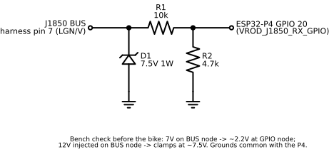
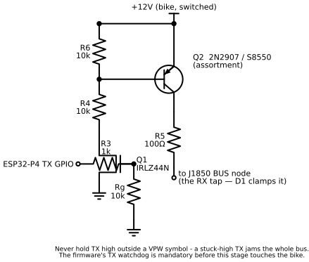
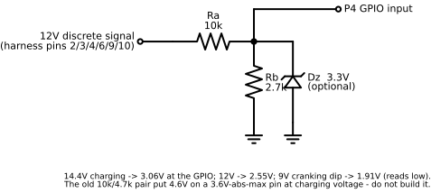

# Hardware reference — BOM, transceiver, proxy box, power

Evergreen build reference: shopping list, system architecture, the J1850
transceiver + discrete dividers, the proxy box, power chain, phone-integration
design, display layout, warnings, dev environment, and external references.
Roadmap/status: [`../ROADMAP.md`](../ROADMAP.md). Bus pinout + decode table:
[`J1850-BUS.md`](J1850-BUS.md).

**Target:** 2009 Harley-Davidson VRSCF Muscle. **Budget:** ~€225-230. Full
custom gauge replacement — 3.4" round 800×800 IPS touch display, BLE phone
integration (iOS ANCS/AMS + Android companion), J1850 read + IM simulation,
proxy development harness, full reversibility to stock.

## Shopping list — confirmed AliExpress cart

### Core components

| Item | Link | Price | Notes |
|---|---|---|---|
| **Waveshare ESP32-P4 3.4" WIFI6 IPS Round Touch LCD** | [AliExpress](https://www.aliexpress.com/item/1005009157965757.html) | ~€86 | The brain. ESP32-P4 360MHz RISC-V dual-core + ESP32-C6 for WiFi6/BLE5. 800×800 round display, optically bonded toughened glass, 32MB PSRAM, 16MB flash (the listing says 32MB; the module on our board is 16MB — see `firmware/sdkconfig.defaults`), dual mics, microSD slot. |

### J1850 bus interface components

| Item | Link | Price | Notes |
|---|---|---|---|
| **5pcs IRLZ44N Logic-Level MOSFET (TO-220)** | [AliExpress](https://www.aliexpress.com/item/1005007434482338.html) | ~€0.77 | J1850 bus TX driver. Logic-level gate turns on at 3.3V. |
| **100pcs Transistor Assortment (incl. 2N2222A)** | [AliExpress](https://www.aliexpress.com/item/1005004188649994.html) | ~€3.77 | J1850 TX high-side switch (Q2). Needs a **PNP** — 2N2907A or S8550; the kit's 2N2222A is NPN and cannot serve as Q2. RX + 12V dividers are passive (zener + resistors), no transistor. |
| **50pcs Zener Diode 1W Assortment (incl. 7.5V)** | [AliExpress](https://www.aliexpress.com/item/1005006639039658.html) | ~€0.65 | Bus voltage clamp protection. Use 7.5V variant. |
| **600pcs Metal Film Resistor Kit (1% precision)** | [AliExpress](https://www.aliexpress.com/item/1005009347924494.html) | ~€20 | Voltage dividers (10kΩ, 4.7kΩ, 1kΩ, 100Ω). Useful long-term for any electronics project. |

### Wiring & connectors

| Item | Link | Price | Notes |
|---|---|---|---|
| **T-Tap Wire Connectors (Mixed)** | [AliExpress](https://www.aliexpress.com/item/1005006872234222.html) | ~€3.34 | For tapping the bike's 12-pin harness without cutting. Red (22-18 AWG) + blue (18-14 AWG) mixed. Need 9 red + 3 blue minimum. |
| **12-Pin Sealed Waterproof Connector** | [AliExpress](https://www.aliexpress.com/item/1005011688911042.html) | ~€23 | Pluggable interface between proxy box and DIY display. (BOM note: the DIY-side connector has since moved to a Deutsch DTM pair — see [`../../firmware/docs/PINS.md`](../../firmware/docs/PINS.md) / connector notes.) |
| **Mini560 Buck Converter 5V (10pcs)** | [AliExpress](https://www.aliexpress.com/item/1005007167054073.html) | ~€4.24 | 12V→5V for the ESP32-P4 power. |
| **Silicone Wire 18-22 AWG (Red/Black, 10m)** | [AliExpress](https://www.aliexpress.com/item/1005007007160447.html) | ~€3 | Heat-resistant, flexible — critical for motorcycle vibration. |

### Prototyping supplies

| Item | Link | Price |
|---|---|---|
| MB-102 Breadboard (830+400 pts + jumpers) | [AliExpress](https://www.aliexpress.com/item/1005011583761439.html) | ~€2.36 |
| Dupont Jumper Wire Kit (M-F, M-M, F-F) | [AliExpress](https://www.aliexpress.com/item/1005003219096948.html) | ~€8.66 |
| Prototype PCB Boards 5×7cm / 7×9cm (10 pcs) | [AliExpress](https://www.aliexpress.com/item/1005008742575241.html) | ~€5.41 |
| JST Connector Kit (SH/GH/ZH/PH/XH) | [AliExpress](https://www.aliexpress.com/item/1005005763085908.html) | ~€27 |
| 2.54mm Pin Headers (M/F, 20 strips) | [AliExpress](https://www.aliexpress.com/item/1005011781229719.html) | ~€2.61 |
| PCB Screw Terminals 2-pin + 3-pin (50 pcs) | [AliExpress](https://www.aliexpress.com/item/1005008625838032.html) | ~€7.37 |

**AliExpress total: ~€205.** Plus local (Tallinn) items — conformal coating
spray (~€10), heat-shrink kit (~€2), IP65 junction box (~€3), PG7 cable glands
(~€1.50), 32GB microSD (~€4), USB-C **data** cable (~€2). **Other total ~€22.**
**GRAND TOTAL ~€225-230.**

### Optional upgrades (buy later, not build-critical)

Solder-seal connectors (~€2), insulated bullet connectors (~€2), waterproof
22mm handlebar momentary button (~€3), BH1750 ambient-light sensor for
auto-brightness (~€1), ML1220 RTC battery (~€2), 3M VHB tape (~€3).

## System architecture

```
                    ┌─────────────────┐
                    │   Your Phone    │
                    │  (Android/iOS)  │
                    │  Waze / GMaps   │── Nav instructions ──┐
                    │  Spotify / etc  │── Track metadata ────┤
                    │  Phone calls    │── Caller ID ─────────┤
                    └────────┬────────┘                      │
                             │ BLE 5 (ANCS/AMS/companion)    │
                             ▼                               │
Bike 12-pin                                                  │
 harness ──► PROXY BOX ──┬──► Stock cluster (dev mode)       │
              [T-taps]    │    OR                            │
                          │    DIY display via 12-pin conn   │
                          └──► Signal taps:                  │
       ┌───────────────────────┘                             │
       ├─ J1850 Data ──► DIY transceiver ──► P4 GPIO         │
       │                  (IRLZ44N + 2N2907A + zener)        │
       ├─ +12V(sw) ─► protected chain ─► Mini560 ─► hdr 5V   │
       ├─ Ground ──► common GND                              │
       ├─ Turn L/R, High beam, Neutral, Oil ──► dividers ──► GPIO
       ├─ Fuel sender ──► P4 ADC pin                         │
       ├─ VSS ──► P4 GPIO (pulse counter)                    │
       └─ Ignition ──► voltage divider ──► P4 GPIO           │
                                                             │
microSD (32GB) ◄── SDIO ── P4 ◄─────────────────────────────┘
  ├── OSM vector map data        ESP32-C6 co-processor (BLE radio only —
  └── Ride data logs               no Bluetooth Classic): WiFi 6 + BLE 5,
                                   phone notifications + media metadata +
                                   transport commands via the companion's
                                   GATT link (Android) or ANCS/AMS (iOS)
```

(IM bus-simulation TX happens on the P4 itself through the transceiver on a
GPIO — the C6 is only the phone radio.) Firmware threading/render architecture:
[`../../firmware/docs/ARCHITECTURE.md`](../../firmware/docs/ARCHITECTURE.md).

## J1850 bidirectional transceiver circuit

> **TX topology RESOLVED (2026-07-04): standard VPW → high-side TX.** The bus
> idles LOW (~0.3 V) and pulses dominant HIGH (~7 V) — textbook active-high VPW.
> The earlier "idle HIGH / low-side / inverted" reading was an artifact of the
> 500 ns hardware glitch filter dropping the slow recessive falling edge.
> Consequences, all landed: **TX is a high-side PNP source (2N2907A)**;
> `CONFIG_VROD_J1850_RX_INVERT` removed; glitch filter defaults off
> (`CONFIG_VROD_J1850_GLITCH_NS=0`). Canonical drawing:
> [`../schematics/j1850_tx.svg`](../schematics/j1850_tx.svg). See the sweep in
> `firmware/docs/captures/SESSION-2026-07-04.md`.

J1850 VPW is an **active-high** single-wire bus: recessive = 0V, dominant = ~7V
*sourced by the transmitting node*. The TX stage is a switched high-side source,
connected to the bus only while transmitting a dominant symbol. (Do NOT build a
permanently-connected 12V pull with a low-side MOSFET shorting to ground — that
inverts polarity and jams the bus dominant whenever idle.)

Build and verify the **RX front end first** — with no FET populated it can't
disturb the bus: [`../schematics/j1850_rx.svg`](../schematics/j1850_rx.svg).



- **Reading:** 10kΩ/4.7kΩ steps the bus ~7.5V → ~2.4V (safe for the P4's 3.3V
  GPIO); node B also feeds GPIO 22 (ADC amplitude probe).
- **Protection:** the 7.5V zener clamps transients on the bus wire.
- **Writing (TX):** high-side PNP source (drawing below). TX GPIO high → Q1
  pulls Q2's base low → Q2 sources ~7V onto the bus (dominant); low → Q2 off,
  bus floats to recessive 0V. A stuck-on TX jams the bus dominant, so the
  firmware watchdog must kill TX if a dominant persists past one VPW symbol.
- **Bench-validate first:** sniff-only (RX, no Q1/Q2) against the live bus; then
  the self-sniff loop (TX → RX node) sets R5 and CRC-checks our own frames.

**Canonical TX — high-side PNP source.** Dominant = ~7V *sourced* onto the bus
via a PNP high-side switch, level-shifted by a low-side NMOS off the 3.3V TX
GPIO:



Node list (matches [`../schematics/j1850_tx.svg`](../schematics/j1850_tx.svg) —
the single source of truth):

- **Q2** (PNP, 2N2907A / S8550): emitter → **+12V**; collector → **R5 100Ω →
  J1850 bus**; base → **node A**.
- **Node A** (Q2 base) is pulled to +12V by **R6 10kΩ** (holds Q2 hard off at
  idle) and toward ground by **R4 10kΩ** in series with **Q1**.
- **Q1** (IRLZ44N, low-side level shift): gate ← **R3 1kΩ** ← P4 TX GPIO;
  source → GND.
- **TX GPIO high** → Q1 on → node A low → Q2 on → bus **sourced HIGH
  (dominant)**. **TX GPIO low** → Q1 off → R6 holds node A at +12V → Q2 off →
  bus released to **0V (recessive)**.
- **D1 7.5V zener** (in the RX drawing) clamps the driven bus level.

A stuck-high TX jams the bus dominant — the firmware TX watchdog is mandatory
before this stage touches the bike. (TX watchdog + on-bike validation:
[`../../firmware/docs/stage4-tx-bench-log.md`](../../firmware/docs/stage4-tx-bench-log.md).)

### 12V discrete signal voltage divider (×6 — turn L/R, high beam, neutral, oil, ignition)



```
12V signal ──── 10kΩ ────┬──── ESP32-P4 GPIO input
                         │
                       2.7kΩ   (optional: 3.3V zener in parallel,
                         │      cathode up — belt-and-braces clamp)
                        GND
```

Sized for the real electrical system, not the nameplate 12V: with the engine
running the "12V" rails sit at ~14.4V charging voltage. An earlier 10kΩ/4.7kΩ
divider gave **4.6V at 14.4V — above the P4's ~3.6V absolute maximum** (P4 GPIOs
are not 5V tolerant). 10kΩ/2.7kΩ gives 2.55V at 12V and 3.06V at 14.4V — a clean
logic high with margin. Per-line active-high/active-low polarity is a firmware
flag (see ROADMAP Phase 6) — the divider hardware is identical ×6.

## Proxy box design

```
┌─────────────────────────────────────────────────────────────┐
│                        PROXY BOX  (IP65 junction box)        │
│  Bike harness ──► T-taps on each wire ──► Internal PCB        │
│  ┌──────────────────────────────────────────────────┐        │
│  │  DIY J1850 Transceiver (IRLZ44N + 2N2907A + 7.5V  │        │
│  │  zener + resistors) ──► Pin 7 (J1850 data)         │        │
│  │  6× voltage dividers (10kΩ + 2.7kΩ) for 2,3,4,6,9,10│       │
│  │  Pins routed through screw terminals               │        │
│  └──────────────────────────────────────────────────┘        │
│  SCREW TERMINALS → P4 via dupont (dev) OR 12-pin conn (test)  │
│  12-PIN OUTPUT → Stock cluster (pass-through) OR DIY display  │
└─────────────────────────────────────────────────────────────┘
```

Lifecycle: **Dev** — Bike → Proxy → Stock cluster (rides normally) + P4 on desk
(sniff/code). **Testing** — Bike → Proxy → DIY display via the 12-pin. **Final**
— Bike → DIY display directly (proxy → toolbox drawer as backup).

## Phone integration (BLE)

- **iPhone — zero setup (built-in ANCS + AMS):** ANCS (notifications, caller ID,
  turn-by-turn) + AMS (track/artist + transport). No companion app; pair via iOS
  Settings. (iOS parsers deferred to Phase 4.)
- **Android — companion app (`companion/`, ✅ Phase 2.5):** Kotlin/Compose with
  `NotificationListenerService` + `MediaSessionManager`, a foreground BLE
  service, LE Secure Connections bonding, device-picker UI. Notifications + media
  → custom TLV over BLE GATT → P4; transport commands come back over the notify
  characteristic. AVRCP is **not** an option — the C6 is BLE-only (no Bluetooth
  Classic), which is exactly why the companion exists.
- **Display priority (high → low):** incoming-call overlay → nav instruction →
  music now-playing ticker → gauges (always visible).

## Display layout (800×800 round)

```
          ╭────────────────────────────╮
        ╱          ╭─────────╮           ╲
      ╱           │  147     │   ┌───┐     ╲
     │            │  km/h    │   │ 4 │      │
     │             ╰─────────╯   └───┘      │
     │   92°C   ⛽████░░   ⏱12,847km        │
     │  ┌──────────────────────────────┐    │
     │  │ ↰ 200m  Pärnu mnt    14:32  │    │
     │  └──────────────────────────────┘    │
      ╲  ♫ Smells Like Teen Spirit         ╱
        ╲   N   phone  beam  warn  wrench ╱
          ╰────────────────────────────╯
```

## Critical warnings

- **Immobilizer:** IM simulation should prevent U1255. If TSSM security still
  fails, use a Screamin' Eagle tuner or keep the stock IM wired in parallel.
- **Weatherproofing:** conformal-coat the PCB; the P4's bonded glass is already
  waterproof on the display side; seal cable entries with PG7 glands; silicone
  wire (vibration + heat); the stock housing gives good water resistance.
- **Legal (Estonia / EU):** a functioning speedometer is required for road use.
  Speed comes from the J1850 bus; run proxy + stock cluster during the testing
  period for redundancy.
- **Power:** keyed +12V (pin 6) for ignition on/off; 470µF cap on the 5V rail to
  absorb cranking spikes; the P4 boots in ~2 s — no graceful shutdown needed.
  Protected power chain: [`../../firmware/docs/bike-power-injection.md`](../../firmware/docs/bike-power-injection.md).

## Development environment

macOS (MacBook Pro); Zed + clangd via `compile_commands.json`; ESP-IDF v6.0.1
(native C/C++); target esp32p4; LVGL 9.x via the ESP-IDF component manager; BLE =
NimBLE host on the P4, controller on the ESP32-C6 via esp_hosted VHCI over SDIO;
programming over USB-C (no separate programmer). Live version in
[`../PROJECT-BRIEF.md`](../PROJECT-BRIEF.md).

## References

| Resource | URL |
|---|---|
| Waveshare P4 3.4C wiki | https://www.waveshare.com/wiki/ESP32-P4-WIFI6-Touch-LCD-3.4C |
| HarleyDroid (decode table + DTC protocol) | https://github.com/stelian42/HarleyDroid |
| DIGTACHO (PIC decoder ref) | https://github.com/momex/DIGTACHO |
| HD J1850 Visual Display | https://hackaday.io/project/162865 |
| J1850 VPW Arduino Library | https://github.com/matafonoff/J1850-VPW-Arduino-Transceiver-Library |
| LVGL documentation | https://docs.lvgl.io |
| ESP-IDF documentation | https://docs.espressif.com |
| ESP32 ANCS library | https://github.com/Smartphone-Companions/ESP32-ANCS-Notifications |
| ESP32 AMS library | https://github.com/marmotton/esp32-apple-media-service |
| OpenStreetMap | https://openstreetmap.org |

## Value comparison

| Solution | Cost | Capabilities |
|---|---|---|
| **This DIY build** | **~€230** | 800×800 display, BLE phone integration, IM simulation, custom UI, ride logging, expansion |
| Motogadget Motoscope Pro + V-Rod adapter | ~€800-1000 | Premium dash, no fuel/gear/ABS |
| Dakota Digital MCV-7000 | ~€500 | Digital gauge, no phone integration |
| Exotic Choppers airbox kit | ~€500-600 | Same Dakota Digital in airbox |
| Stock cluster repair | ~€600-800 | Just back to OEM |

*Stock speedometer dial 75mm | Display 86mm (3.4" round, 800×800) | fits inside
the 95mm stock cluster housing with minor bezel modification | the proxy harness
allows full reversion to stock anytime (dealer visits, resale).*
