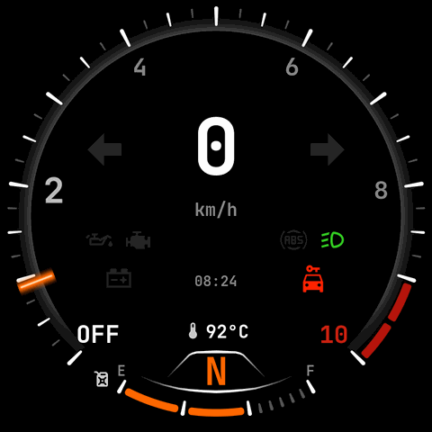
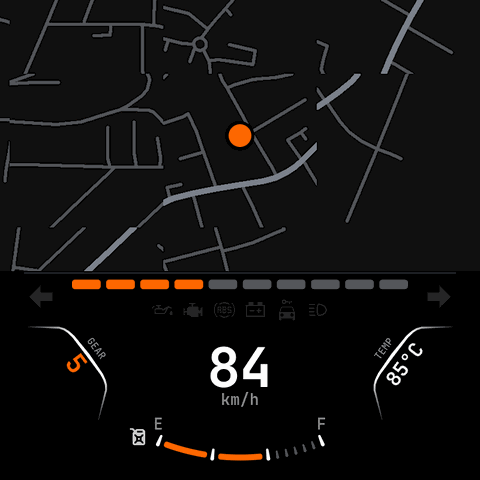
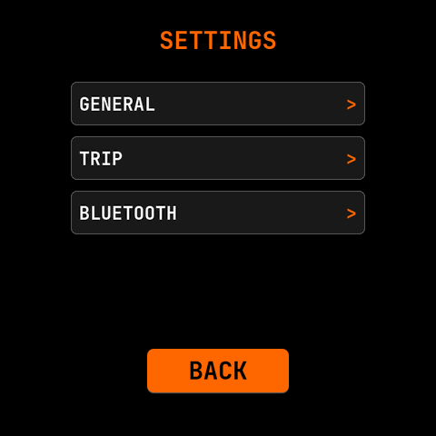
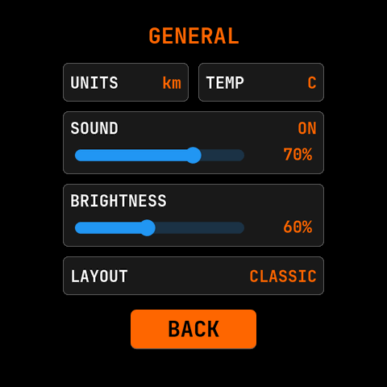
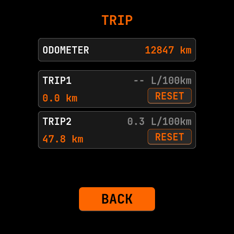
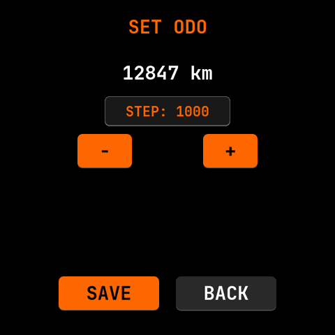
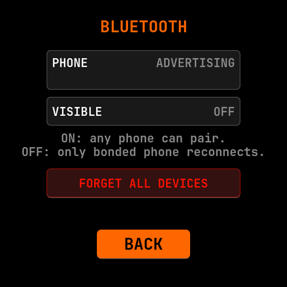

# Screen layouts

Real renders of the cluster UI, captured headlessly from the desktop simulator
(`firmware/simulator/`) — the same widget code that runs on the P4, not mockups.
The physical panel is the inscribed circle of the 800×800 square (the case hides
the black corners). Images are downscaled to 480 px and palette-quantized for the
repo (see "Regenerating" below).

## Ride / gauge screen


The primary screen (BMW-EfficientDynamics styling). Layout:

- **Tach** — 270° arc around the rim: capsule ticks, zoom + colour-coupled
  labels 2/4/6/8/10, a two-segment rounded **redline** (red, lower right), and a
  baked Gaussian **cursor** sprite tracking RPM. `OFF` (lower left) is the
  shift-light state.
- **Speed** — large centre digits (three slots, `km/h` / `mph` per settings),
  flanked by the **turn-signal** arrows.
- **Warning lamps** — two chevrons: oil, check-engine, ABS, battery,
  immobiliser (car-key), high/low beam (slot rotates).
- **Clock + odometer + dual trips** cycle in a shared slot; **temperature**
  readout; **gear** indicator in the bottom selector (orange `N`).
- **Fuel** — arc across the bottom (E→F), red when low, jerrycan icon.

Idle / key-on state (engine off, immobiliser + battery lit, `N`):



## Map screen



Reached by double-tapping off the gauge: SD-streamed vector tiles, heading-up
rotation, position dot (dual-source — onboard NEO-6M preferred, phone GPS
fallback), and a **compact cluster** strip below — RPM bar, warning lamps, a
slanted gear panel, centre speed, temperature, and the fuel arc.

## Settings

| | |
|---|---|
|  |  |
| **Menu** — General / Trip / Bluetooth. | **General** — units, temp unit, sound + brightness sliders, layout (classic / map). |
|  |  |
| **Trip** — odometer + dual trips, reset. | **Set ODO** — seed the odometer (step + / −, save). |
|  | |
| **Bluetooth** — advertising state, visibility toggle, forget-all-devices. | |

## Regenerating

The simulator dumps the active screen to PNG headlessly via `VROD_SHOT` (needs
SDL2; `brew install sdl2`). `VROD_SCREEN=<name>` jumps to a settings screen;
`VROD_MAP_ZMTA` renders the map; `VROD_SHOT_FRAMES` picks the driving-cycle
frame; `VROD_NO_DEVBTN=1` hides the simulator-only dev buttons.

```sh
cd firmware/simulator
cmake -B build -S . && cmake --build build --parallel

# Gauge (moving ~frame 1400) and idle (frame 90):
VROD_SHOT=/tmp/gauge.png       VROD_SHOT_FRAMES=1400 VROD_NO_DEVBTN=1 ./build/vrod_sim
VROD_SHOT=/tmp/gauge-idle.png  VROD_SHOT_FRAMES=90   VROD_NO_DEVBTN=1 ./build/vrod_sim
# Map + compact cluster (demo corridor, centred on the demo track):
VROD_SHOT=/tmp/map.png VROD_SHOT_FRAMES=150 VROD_NO_DEVBTN=1 \
  VROD_MAP_ZMTA=../main/assets/corridor.zmta VROD_MAP_CENTER="59.4802377,24.8538196" ./build/vrod_sim
# Settings family:
for s in settings settings-general settings-trip settings-odoset settings-bluetooth; do
  VROD_SHOT=/tmp/$s.png VROD_SHOT_FRAMES=70 VROD_NO_DEVBTN=1 VROD_SCREEN=$s ./build/vrod_sim
done
```

Then downscale to 480 px + palette-quantize (small, crisp; `sips` re-encodes PNG
poorly, so use Pillow):

```sh
python3 -c 'from PIL import Image;import sys
for p in sys.argv[1:]:
    im=Image.open(p).convert("RGB").resize((480,480),Image.LANCZOS)
    im.quantize(256,method=Image.Quantize.FASTOCTREE).save(p,optimize=True)' /tmp/*.png
```

See `firmware/simulator/main.c` for the full env-var list (`VROD_SCREEN`,
`VROD_MAP_*`, `VROD_NO_BEZEL`, `VROD_PERF`, …). The bench (`VROD_J1850_SNIFFER`
build) and BLE-pairing screens aren't in this gallery — the first needs the
sniffer build + live stats, the second is a transient pairing prompt.
