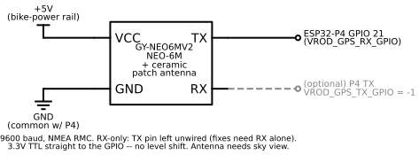

# NEO-6M GPS module (map position)

Optional onboard GPS (a GY-NEO6MV2 / NEO-6M) that feeds the moving-map view a
**local, low-latency position** so the map works **without the phone** and
scrolls smoothly (5-10 Hz vs the phone's ~1 Hz over BLE). Position only — no
POI / speed-camera / turn-by-turn (that scope stays dropped).

The map is **dual-source**: it prefers a fresh module fix and falls back to the
phone GPS over BLE when the module is stale or absent, so nothing breaks whether
or not the module is fitted.

## Wiring



*(source: `docs/schematics/gps_module.py`; regenerate per `docs/schematics/README.md`)*

| Module pin | Wires to | Notes |
|------------|----------|-------|
| **VCC** | **board +5V** — the 40-pin header 5V (`VCC_5V`) | Same rail whether USB-fed (bench) or bike-power-fed (bike). Onboard MIC5205 makes the chip's 3.3V; ~45 mA — negligible next to the board's ~1 A. |
| **GND** | **GND** — any header ground (common with the P4) | |
| **TX**  | **ESP32-P4 GPIO 21** (`VROD_GPS_RX_GPIO`) | Module's 3.3V TTL straight into the 3.3V GPIO — **no level shifter**. |
| **RX**  | *(leave unwired)* | Only needed to push UBX config (fix rate / constellations). RX-only gives fixes. `VROD_GPS_TX_GPIO = -1`. |

GPIO 21 was the old (dropped) GPS NMEA pin and is otherwise free — see
`PINS.md`. The GPIO matrix routes any UART to any pin, so the UART *number*
(`VROD_GPS_UART_NUM`, default 1 — never UART0, that's the console) hardly
matters.

## Firmware config

`idf.py menuconfig` -> **V-Rod cluster** ->

- **Read a NEO-6M/M8N GPS module on a UART** (`CONFIG_VROD_GPS_UART`) — off by
  default; enable it once the module is wired.
- **GPIO wired to the module's TX pin** (`CONFIG_VROD_GPS_RX_GPIO`, default 21).
- **GPS module baud rate** (`CONFIG_VROD_GPS_BAUD`, default 9600 — NEO-6M/M8N
  factory default).

With the option off, `gps_source` compiles as an empty store and the map uses
the phone; nothing else changes.

## Software path

```
UART bytes ─▶ nmea_framer_push ─▶ nmea_parse_rmc ─▶ gps_source_set
                                                        │
                              map_sd anim_task ◀────────┘  (prefers module,
                              phone_data (BLE) ◀──────────  falls back to phone)
```

- `main/gps/nmea.c` — pure NMEA 0183 framer + RMC parser (host-tested, 100%).
- `main/gps/gps_source.c` — mutex-guarded latest-fix store (host-tested).
- `main/gps/gps_uart.c` — the UART reader task; publishes fixes stamped with a
  monotonic receive time so the map can age them out if the module goes silent.
- Fusion lives in `main/map/map_sd.c` (`GPS_MODULE_STALE_MS = 3000`).

## Bench bring-up

1. Wire per the table above; enable `CONFIG_VROD_GPS_UART`; flash.
2. Put the antenna where it can see the sky (a window ledge is enough).
3. Cold fix takes ~30-60 s; the module's on-board LED blinks once per second
   when it has a fix.
4. On a map (SD) build the marker jumps to the real position and heading-up
   rotation follows the module's course-over-ground — no phone needed.
5. To sanity-check the stream without the UI: temporarily log in
   `gps_uart_task` (`ESP_LOGI` the parsed `rmc.lat_e7/lon_e7/valid`).

## Antenna placement (Phase 6)

The one real constraint is **sky view**. The round cluster is metal-adjacent;
the patch antenna wants to face up/out. This is an enclosure decision for
Phase 6 — the ceramic patch can sit on top of the module or move to a small
external puck if the case blocks it.
